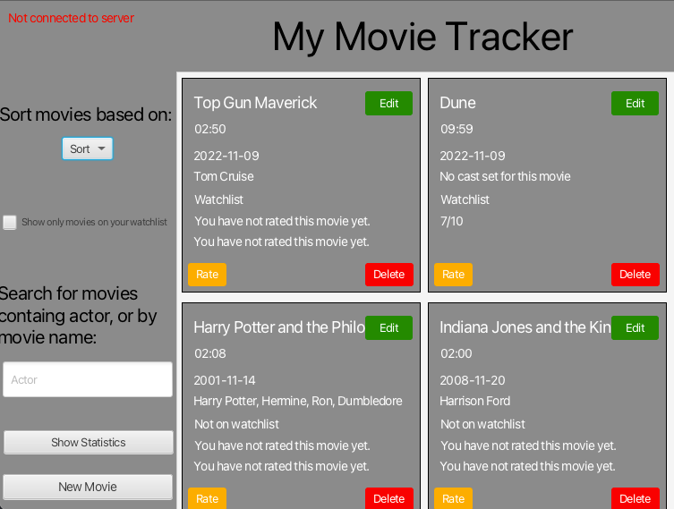
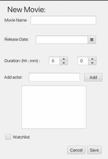
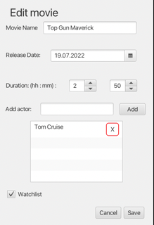
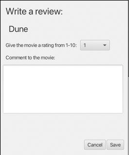
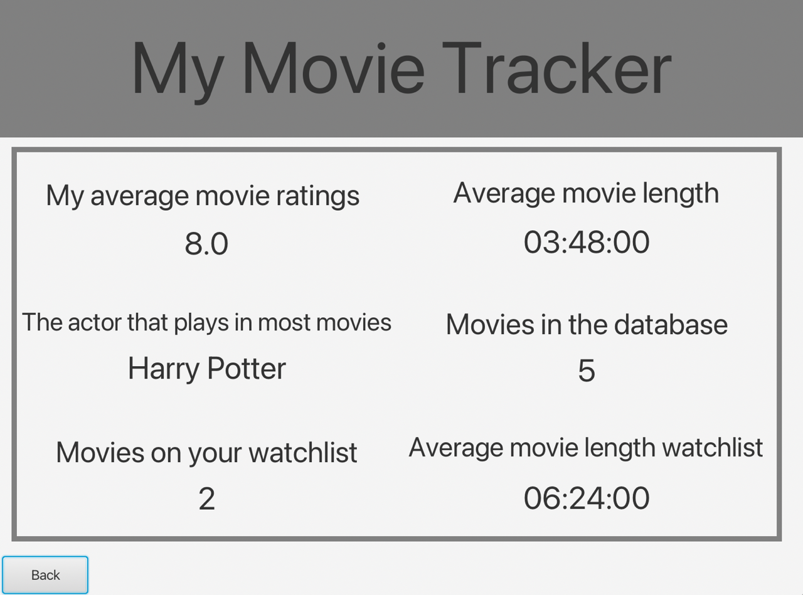
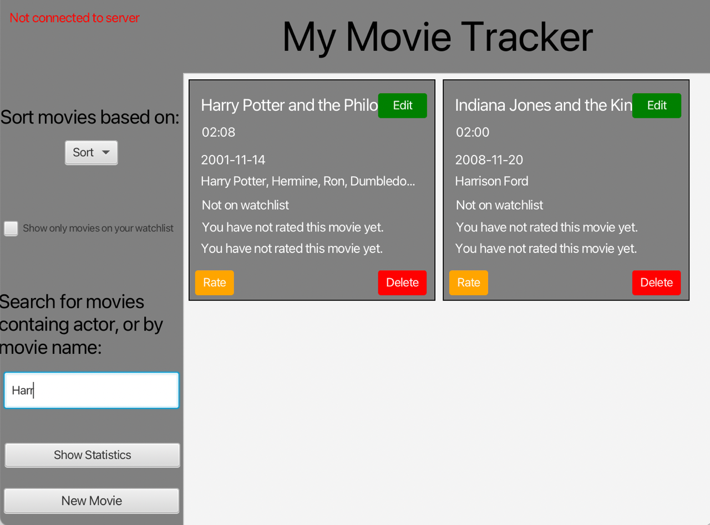
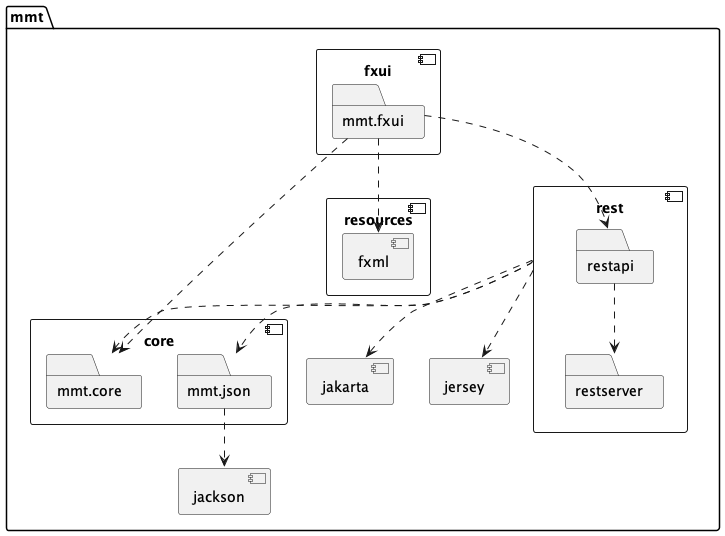
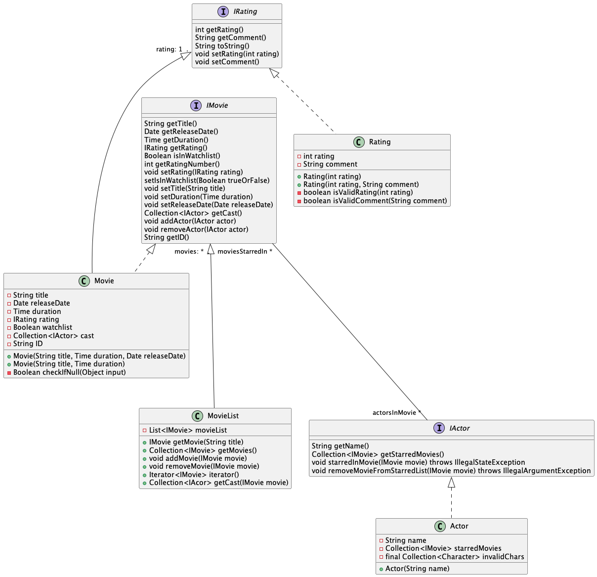
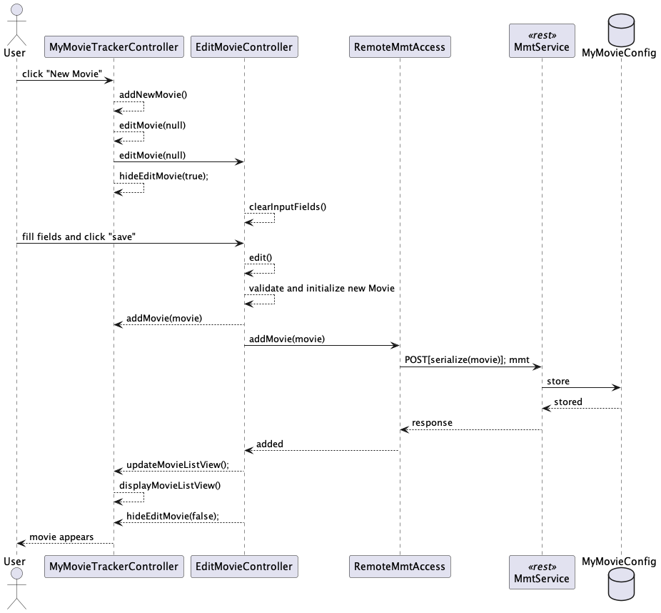

[](https://gitpod.stud.ntnu.no/#https://gitlab.stud.idi.ntnu.no/it1901/groups-2022/gr2238/gr2238/-/tree/master/)
# My Movie Tracker

My movie tracker is a project for the course IT1901. 

Functionality currently implemented in the application: 
- Add movies to the database.
- Edit current movies in the database.
- Make a review of the movie.
    - Comment the movie.
    - Rate the movie from 1-10.
- Delete a movie from the database.
- Sort movies by:
    - Title.
    - Rating
    - Duration 
- Take of/take on watchlist
- View only movies on your watchlist
- Search for movies by title
- Search for movies by actor
- Look at a statistical view of your movielist
    - Number of movies
    - Number of movies on watchlist
    - Average duration
    - Actor that plays in the most movies
    - Average rating
    - Average duaration of movies on your watchlist

- Run the app locally
- Run the app using a rest api

## Finished product
We now se the MMT app as a finished product. We have implemented all of the functionality described in the userstories. If we were going to have more sprints of this project, our next focus points would be to create a more pleasing fxml design, as well as another application (i.e web-application). There is also possibilities to perform usertests and get feedback to more functionality that could be added. In the coming parts, you will be able to read about and view the different functionality the app has to offer.

### Main page
This is the main page of My Movie Tracker. The user is now able to add a new movie to the database, edit the movie, review the movie and delete the movie from the database. It is also possible to sort the movies by title, rating and duration by clicking on the "Sort" button. The button located below sort will show all movies added to the users watchlist when clicked. The user also has the possibility to open the [statistic view](#statistics), or [search for movies by actor or movie name](#search-for-movies).



### New Movie
When the "New Movie" button is clicked, the new movie page will appear on the screen. As the picture shows, the user will have the opporunity to set title, release date, duration and if wanted, put the movie on the watchlist and add a cast to the movie.


### Edit

The "Edit" button will show a new page where the user can edit a movie. As shown in the picture, the current fields of the movie will show in the input spaces. The user will easely be able to edit the movie by changing the current value of an input space to something else.
This is the same view as [add movies](#new-movie), however, the title has been changed in the controller.


### Rate
The "Rate" button will also show a new page. This page enables the user to review a movie. The user can leave a comment on the movie and rate the movie from 1-10. 


### Statistics
Once you press the button to view the statistics view, you will be able to look at the different statistics mentioned in the [MMT](#my-movie-tracker) describtion. The user also has the possibility to go back to the main view using the back button.


### Search for movies
The last of the new functionality added to the mmt app, is the possibility to search for movies. As you can see in the picture below, the user has searched for movies containing either an actor who has got a name containing `Harr` or for a movie that contains `Harr` in its title. This updates the listview shown to the user, and allows it to search for its favorite movies.


## Diagrams
We have created three different diagrams for the project.
- A Package Diagram for [the projects architecture](#the-projects-architecture).
- A [Class diagram](#core-class-diagram) showing the interaction between the core package.
- A [sequence diagram](#sequence-diagram) showing how the main part of the project interaction is set up. When a user creates a new movie, and which methods that is used.
### The projects architecture
Here you can view the project architecture through our puml package diagram:



### Core class diagram
We have choosen to create a class diagram displaying the interaction between the classes in the core package. We have choosen to display this part of the project as we see it as the most important part of the project. This is the back-end part, and where all data input by the user is handled. You can view the diagram under:


### Sequence diagram
We have also updated the sequence diagram from release 2. We have addded the method-calls that happens between the server and ui when adding a movie. The other base endpoint calls you can make is all pretty similar to the one shown here, and can be read more about in detail [in the rest README](rest/README.md) file.



## Shippable product - Export the project
The goal with making the project shippable, is to be able to open the app without using an editor or maven commands. This will download an app that the user can place on their own computer. The plugin JLink assembles the projects modules and dependencies into a new folder using the JavaFx developers plugin. JPackage is the pluging that creates the app for the user.  

To run this plugin you have to be in a terminal window. From there, you have to `cd`into the `fxui`folder. From there you can run the following command:

```
mvn clean compile javafx:jlink jpackage:jpackage
```
This will generate a `.dmg` if you are on OSX system, `.exe` on windows or `.run` on linux, file in the `mmt/fxui/target/dist` folder. This will give the app that it can use to open the MMT app.
