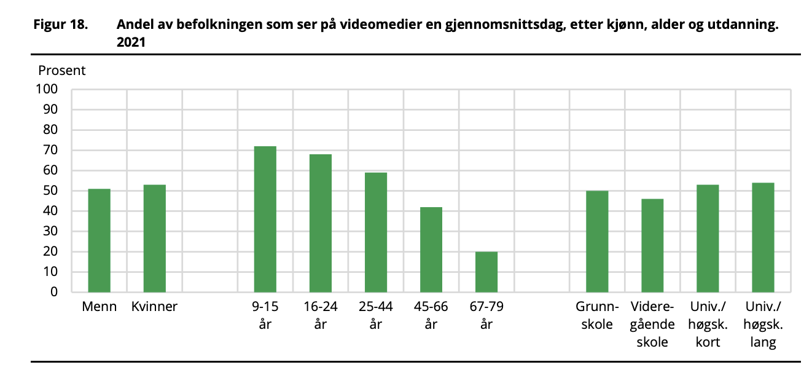
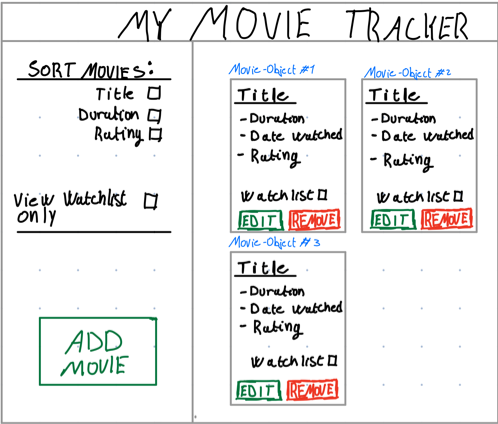

# Userstories
- As a user, I want to add movies to a list that contains movies that I find interesting, so that when i want to watch a movie I know which ones i like.

- As a user, I want to be able to add movies that I like to a watchlist that contains movies that I am due to watch, so that I know which movie I should watch when the weekend comes

- As a user, I want to remove movies from a list which contains movies that I like, in case i do not like them anymore

- As a user, I want to sort my list of movies that I like based on duration, so that if a friend asks me for a good movie that lasts less than an hour

- As a user, I want to sort my list of movies that I like based on the title, so that when I have a lot of movies in my list, it is easy to find the one I am looking for

- As a user, I want to sort my list of movies that I like based on rating, in case someone asks me what my all-time favorite movie is, it is easy for me to figure out which.

- As a user, I want to have a list of movies that I find interesting available so that I have suggestions when being asked for a recommendation

- As a user, I want to write a short summary of each movie that I like, so that at a later time I would remind myself of what the movie was about when considering watching it

- As a user, I want to give each movie that a like a rating on a 1/10 scale (1, 2, ...,10), so that I know which movie is the best of the best

- As a user, I want to see relevant statistics of the movies in my movie list, so that I can get a quick overview of what it contains 

# Conceptual model

## Concepts

### Design metaphor
- A Movie-object has a rectangular shape, just like a movie poster, with its attributes displayed on the front of this "poster" similar to a typical movie poster layout. 

### Data-objects 
- Movie-objects that can be initiated and deleted
- A "database" list-object which contains all Movie-objects that the user initiates
- A "watchlist" list-object which is a sublist of the "database" list-object, in which the user can add and remove Movie-objects

### Data-object attributes and operations

#### Movie-object attributes
- Title
- Release date
- Duration
- Rating (1, 2, ..., 10)
- Watchlist (boolean: in or not in the watchlist)

#### Movie-object operations
- Set and edit all attributes

#### List-object attributes
- A list consisting of Movie-objects, size initially zero

#### List-object operations
- Sort the Movie-objects contained in the list based on rating, title and duration
- Add Movie-objects
- Remove Movie-objects

### Relations
- The "database" list-object contains all the Movie-objects initiated by the user
- The "watchlist" list-object is a sublist of the "database" list-object
- The Movie-object has a title, release date, duration and rating

### Mapping
- The list-objects corresponds to a library of movies
- A Movie-object corresponds to an existing movie which the user is able to give his or hers own rating. Duration, title and cast is also determined by the user.

# Personas

Our personas are based on the user stories and the article "Norsk mediebarometer 2021" conducted by SSB, Statistics Norway [^1]. From the article, it appears that young men watch the most video and film media on average every day. That is why Magnus is one of our personas. If we manage to make an app that satisfies Magnus, our app should satisfy a large group of users in Norway, which is our goal. Figure 1 displays the proportion of the population that watches video media on an average day, by gender, age and education, in 2021. As one can see, there are also a lot of women that watch movies in the age group 25-44. That is why we included Live, so that the impacts of her and Magnus on the app can complement each other, and make a great product. We do not have personas for the age group 9-15 years old. The reason is that our target group and the users we have interviewed do not find themselves in this age group. Nevertheless, interviewing younger users should be considered when further developing the app in the future
[^1]: https://www.ssb.no/kultur-og-fritid/tids-og-mediebruk/artikler/norsk-mediebarometer-2021/_/attachment/inline/21eec81a-a3d3-4cac-abd5-f08465e840a0:c55b76d6b22c727056ab0b4c3cb8798e4142820d/SA169_web.pdf

*Figure 1: proportion of the population that watches video media on an average day, by gender, age and education, in Norway in 2021.*

## Magnus Lysnes

*Photo retrived from freepik.com, free license*[^2]

[^2]: https://www.freepik.com/free-photo/male-worker-factory_4410543.htm

### Description

Magnus is a construction worker in a mid-sized company. He is 27 years old and holds no academic degree. He watches lots of movies and has good software-app competence. Because of his good competence, he has certain expectations of software apps. They have to be efficient and fast, and easy to navigate.
 
### Familiarity with software applications

:large_blue_circle: :large_blue_circle: :large_blue_circle: :large_blue_circle: :large_blue_circle:

(5/5 - great knowledge)

### Goals
- When a good movie comes up, be able to save it in an efficient way
- Not too many "clicks" in the app to see what movies are saved
- Be able to favourite movies in some way
- Be able to sort based on duration, due to his lack of time on busy days

### Frustrations
- Forgets the movie he was supposed to watch
- When it takes too long time to navigate in software apps

 ### Interests

 :large_blue_circle: :large_blue_circle: :large_blue_circle: :large_blue_circle: :white_circle:  &nbsp;  **Tech**

 :large_blue_circle: :large_blue_circle: :white_circle: :white_circle: :white_circle:  &nbsp;  **Science**

 :large_blue_circle: :white_circle: :white_circle: :white_circle: :white_circle:  &nbsp;  **Politics**

 :large_blue_circle: :large_blue_circle: :large_blue_circle: :white_circle: :white_circle:  &nbsp;  **Business**

### Usability priorities

&nbsp; &nbsp; &nbsp; 
&nbsp; &nbsp; &nbsp; &nbsp; &nbsp; &nbsp; &nbsp;
&nbsp; &nbsp; &nbsp; &nbsp; &nbsp; &nbsp; &nbsp; &nbsp; &nbsp;

**Time efficient** &nbsp; &nbsp; **Functionality** &nbsp; &nbsp; **Easy to navigate**

### Data priorities

&nbsp; &nbsp; &nbsp; 
&nbsp; &nbsp; &nbsp; &nbsp; &nbsp; &nbsp; &nbsp; &nbsp; &nbsp; &nbsp; &nbsp; &nbsp;
&nbsp; &nbsp; &nbsp; &nbsp; &nbsp; &nbsp; &nbsp; &nbsp; &nbsp; &nbsp; &nbsp; &nbsp; &nbsp; &nbsp; &nbsp; &nbsp; &nbsp;

**Good metadata** &nbsp; &nbsp; **Save and load data** &nbsp; &nbsp; **Human readable stored data (JSON)**

### Motivations

&nbsp;

## Live Langåsen

*Photo is private*

### Description

Live is 40 years old and works as a doctor at the St. Olavs hospital. Her days are usually quite busy. When she is not working, she loves spending quality time with her husband and two young children. They often watch a movie together. If it is a good movie, Live would like to recommend it for her friends, her colleagues and her patients. In Lives opinion, movies are always a great subject to talk about to get the conversation going. When talking about movies with others, she also often recive recommendations. Sadly, due to busy days of work, she often forgets the movie she was recommended. 

### Familiarity with software applications

:large_blue_circle: :large_blue_circle: :large_blue_circle: :white_circle: :white_circle:

(3/5 - avrage knowledge)

### Goals
- Keep track of movies by removing and adding movies
- Able to categorize movies
- For each movie, add her own review of it
- Able to distinguish the movies she has and has not seen (in case reciving a recommendation, and want to watch it later) 
- An app that is easy and fast to use- as few clicks as possible!

### Frustrations
- Having to retain knowledge of each movie she watches
- When reciving a movie recommendation, it is easy to forget
- software apps that are to complex and has unnecessary functions
 

 ### Interests

 :large_blue_circle: :large_blue_circle: :white_circle: :white_circle: :white_circle:  &nbsp;  **Tech**

 :large_blue_circle: :large_blue_circle: :large_blue_circle: :large_blue_circle: :white_circle:  &nbsp;  **Science**

 :large_blue_circle: :large_blue_circle: :large_blue_circle: :white_circle: :white_circle:  &nbsp;  **Politics**

 :large_blue_circle: :large_blue_circle: :white_circle: :white_circle: :white_circle:  &nbsp;  **Business**

### Usability priorities

&nbsp; &nbsp; &nbsp; 
&nbsp; &nbsp; &nbsp; &nbsp; &nbsp; &nbsp; &nbsp;
&nbsp; &nbsp; &nbsp; &nbsp; &nbsp; &nbsp; &nbsp;

**Time efficient** &nbsp; &nbsp; **Accessible** &nbsp; &nbsp; **Easy to navigate**

### Data priorities

&nbsp; &nbsp; &nbsp; 
&nbsp; &nbsp; &nbsp; &nbsp; &nbsp; &nbsp; &nbsp; &nbsp; &nbsp; &nbsp; &nbsp; &nbsp;
&nbsp; &nbsp; &nbsp; &nbsp; &nbsp; &nbsp; &nbsp; &nbsp; &nbsp; &nbsp; &nbsp; &nbsp; &nbsp; &nbsp; &nbsp; &nbsp; &nbsp;

**Good metadata** &nbsp; &nbsp; **Save and load data** &nbsp; &nbsp; **Human readable stored data (JSON)**

### Motivations

# UI Mockup milestone 2

# Sources
Last quality control: 17. nov 2022

